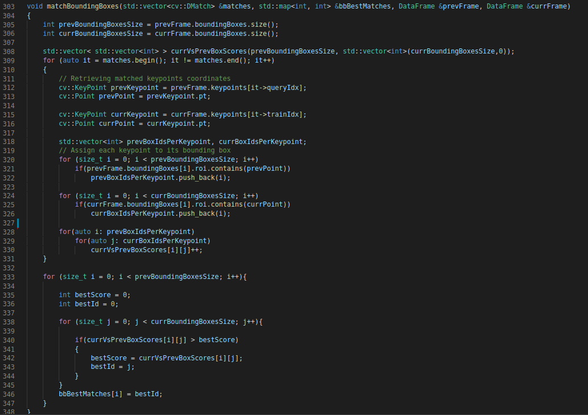
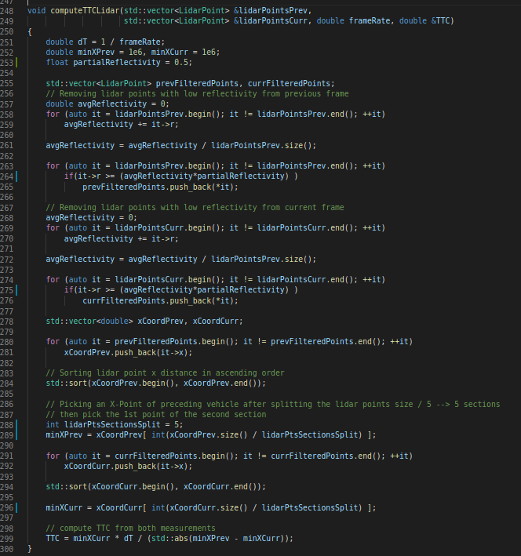
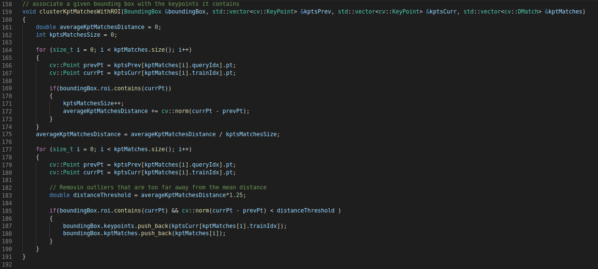
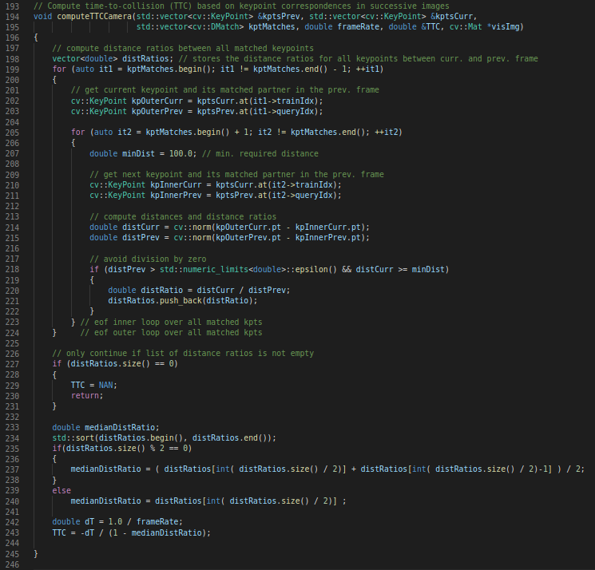
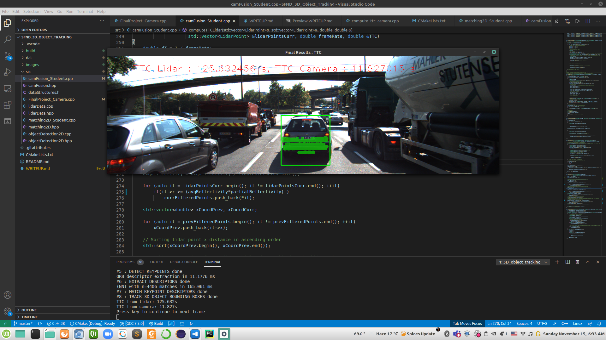

# 3D Object Tracking using Camera & Lidar to Calculate Time to Collision

This file describes all the project ruberic points 

## 1- Match 3D Objects  

### CRITERIA  

Implement the method "matchBoundingBoxes", which takes as input both the previous and the current data frames and provides as output the ids of the matched regions of interest (i.e. the boxID property). Matches must be the ones with the highest number of keypoint correspondences.  

### SOLUTION  

Created currVsPrevBoxScores 2D vector to store the scores of each box in the previous frame versus the scores of each box in the current frame and
based on the scores we select the best match  

## 2- Compute Lidar-based TTC  

### CRITERIA  

Compute the time-to-collision in second for all matched 3D objects using only Lidar measurements from the matched bounding boxes between current and previous frame.

### SOLUTION   

1. I calculated the average reflectivity of all points in the previous and current frame
2. Removed points with reflectivity `r` below `average reflectivity` * __partialReflectivity__ variable which ranges from **0.0 to 1.0**
3. Divided the lidar points container of each frame into `n` sections and picked the first element of the second section to avoid outliers failures

## 3- Associate Keypoint Correspondences with Bounding Boxes  

### CRITERIA  

Prepare the TTC computation based on camera measurements by associating keypoint correspondences to the bounding boxes which enclose them. All matches which satisfy this condition must be added to a vector in the respective bounding box.

### SOLUTION   

1. Filter key point matches according to the distance to average match distance
2. Associate a given bounding box with the keypoints it contains and the corresponding matches

## 4- Compute Camera-based TTC  

### CRITERIA  

Compute the time-to-collision in second for all matched 3D objects using only keypoint correspondences from the matched bounding boxes between current and previous frame.

### SOLUTION   

Calculated the **median** distance ratio instead of **mean** distance ratio

## 5- Performance Evaluation 1 ***TTC estimate of the Lidar sensor***

### CRITERIA  

Find examples where the TTC estimate of the Lidar sensor does not seem plausible. Describe your observations and provide a sound argumentation why you think this happened.

### SOLUTION   

1. When I tried to remove points with reflectivity `r` below average reflectivity, alot of points have been removed, so I tweaked a variable __partialReflectivity__ to take partial of average reflectivity, I got a better performance

2. When I divided the lidar points container of each frame into `n` sections , I got high TTC when `n` was in range **1 to 4** and when Increased `n` to **8 to 10** I got a stable TTC

## 6- Performance Evaluation 2 ***TTC estimate of the Camera sensor***

### CRITERIA  

Run several detector / descriptor combinations and look at the differences in TTC estimation. Find out which methods perform best and also include several examples where camera-based TTC estimation is way off. As with Lidar, describe your observations again and also look into potential reasons.

### SOLUTION   

### Top three detectors 

From midterm project

| Approach no. | Detector + Descriptor | Total Keypoints | Total Matches | Time(ms) |
|------------- | ------------- | ------------- | ------------- | ------------- |
| 1 | FAST + BRIEF | 5063 | 229 | 32.8021 ms |
| 2 | FAST + ORB | 5063 | 218 | 31.1273 ms |
| 3 | Shi-Tomasi + BRIEF | 1370 | 96 | 45.8341 ms |

The TTC estimation results are shown in the table below.

|Approach no. | Lidar | FAST + ORB | FAST + BRIEF |SHITOMASI + BRIEF |
|:---:|:---:|:---:|:---:|:---:|
|1 |13.3|10.3 |10.8 | 13.2|
|2 | 10.5|10.3 |11.0 | 14.0|
|3 | 22.5|11.1 |14.2 | 9.5|
|4 |14.5 |12.8 |15.4 | 15.0|
|5 |10.2 | 17.8|20.0 | 12.8|
|6 |13.0 |13.0 |13.3 | 13.3|
|7 | 11.4|11.6 |12.2 | 15.3|
|8 |12.8 |11.2 |12.8 | 12.6|
|9 |13.2 |12.1 |12.6 | 11.9|
|10 |15.5 |13.3 |13.5 | 12.6|
